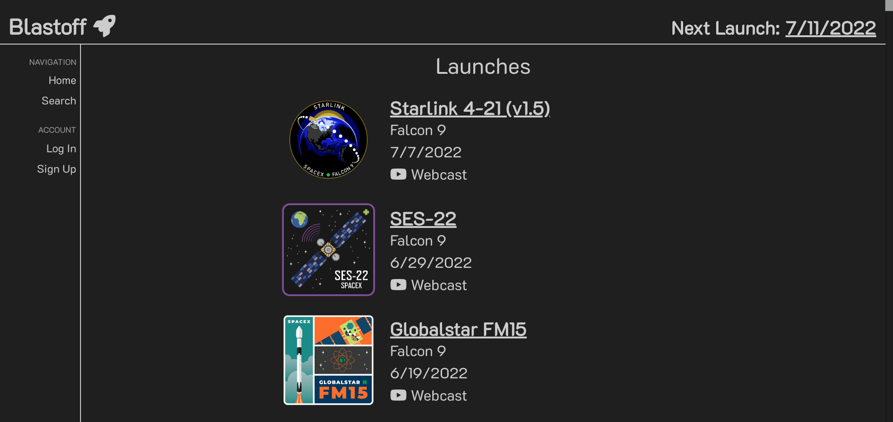
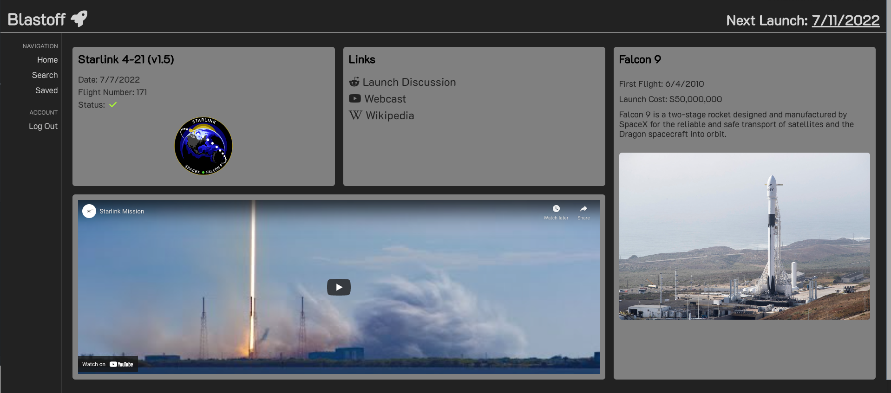
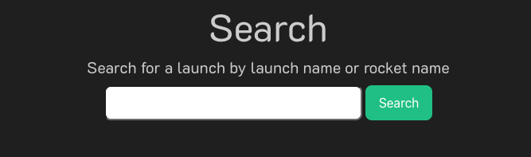

# Project-2 Blast OFF!

## Table of Contents

1. [User Story](#user-story)
2. [Description](#description)
3. [Usage](#usage)
4. [Installation](#installation)
5. [Visuals](#visuals)
6. [Technology Used](#technologies-used)
7. [Resources](#resources)
8. [Authors and Acknowledgements](#authors-and-acknowledgements)

## Description

Our website is a space launch application that allows users to see the upcoming space launches from SpaceX. The user will not be able to interact with the application unless they have an account or created an account. Once login/signup is complete, the user gains the ability to add comments about any launch. The user also has the ability to add their favorite launches on the saved pages. The user also has the ability to search by the launch name or rocket name. 

## User Story

```
AS A user who needs information on Space launches,

I WANT to be able to see information about the launch details that is upcoming,

SO THAT I have a fun and creative way to keep up with upcoming, past shuttle launches and more.
```

## Usage 

How would a user use this application:

- Step 1: When the user first open the application they are prompt with the home page with navbars. The user can view only the home page with a list of launches. 

- Step 2: User would need to login/signup in order to view more detail about the launch 

- Step 3: Once user login/signup the user can track the launch they want and it will be in the watched section 

- Step 4: When user click on a specific launch, user is allow to click on the favorite button and it is saved to saved page

- Step 5: The user has the ability to search by launch name or rocket name in the search page

## Installation

To install this application, install the following packages below:

```
npm i bcrypt connect-session-sequelize dotenv express express-handlebars express-session mysql2 sequelize
```

## Visuals

This is the home page of our web application 



This is what the user will see when a launch is clicked 



This is the comments section where a user can comment on a launch


This is the search section where a user can search by launch name or rocket name 



## Features

- Have to login/signup in order to interact with the website
- Ability to add comments on a launch
- Use API to get the upcoming launch

## Technologies Used

- GitHub
- VSCode
- HTML5
- CSS
- Javascript
- NodeJS
- ExpressJS
- MySQL
- Sequelize
- Heroku
- SpaceX REST API

## Resources

* [GitHub Repository](https://github.com/JtheFox/blastoff)

* [Heroku](https://blastoff2.herokuapp.com/)

## Authors and Acknowledgements

Coded and Develop by Jason Fox, Vanessa Liaw, Graham Purnell and Raymond Dover